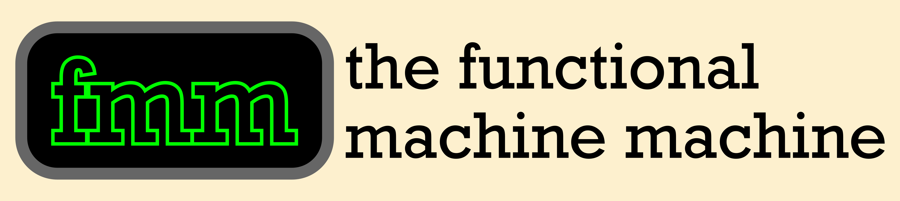

# FMM - A Web-based interactive visualiser for the Functional Machine Language with Choice

### Features

- Interactive visualisation of untyped FMC terms
- Stepwise inspection of FMC's abstract machine
- Immediate evaluation of arbitrary FMC terms

FMM (The Functional Machine Machine) is a Web-based JavaScript implementation and
visualisation of the Functional Machine Calculus with Choice. FMM allows the user
to input an FMC term, inspect its parse tree, and visualise how the FMC's abstract
machine evaluates the FMC step by either stepping through the transitions or by
immediately evaluating the term through the machine.

FMM visualises all aspects of the machine, including all main terms stepped through,
the current state of the continuation and location stacks, any outputs returned by
the machine, and the current main term represented as a parse tree. This provides an
interactive tool for understanding FMC and its potential applications.

### Run FMM

FMM can be deployed locally without the need of Node.js.

For local access, clone this repository and open index.html in your browser.

### License

This software uses jQuery 3.7.1, which is licensed under the MIT License.